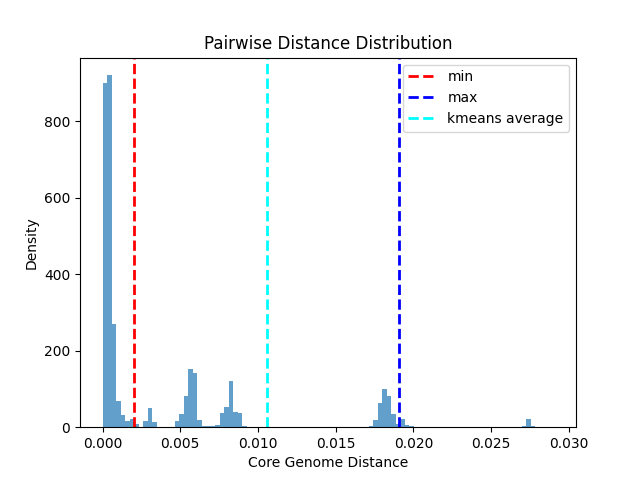
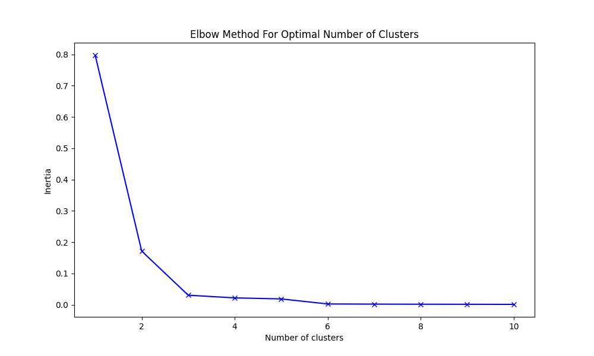

# Tool instructions
<br>

**List of Tools** 
- [PP kmeans Stats](#pp-kmeans-stats)

<br> 

---

<br>

### PP kmeans Stats

[This script](https://github.com/DOH-HNH0303/PopPUNK_tools/blob/dev/db_individual_tools/pp_kmeans_stats.py) takes distance files in long-format via a tsv (such as those generated by [this POPPunk script](https://github.com/bacpop/PopPUNK/blob/master/scripts/poppunk_extract_distances.py)) and returns stats and plots of core genome distances. A histogram of the core genome distance is created and the min, max, and mean k centers are plotted on the histogram. An Elbow plot is also created for the data to verify that the cluster count used (2) is appropriate as well as to vizualise the rate at which the genetic distances increase within/between clusters based upon how many clusters (k) are given as input to calculate kmeans.

#### Example Use:
```
python pp_distance_stats.py --prefix cauris_fungus_threshold0-003_curated
```

#### Example Terminal Output:
```
Histogram of genetic distances has been saved to cauris_fungus_threshold0-003_curated_distances.png
Kmeans centers are 0.0020304642921933737 and 0.01907809146238115
Determined core genome distance threshold: 0.010554277877287261
Elbow plot as been saved to cauris_fungus_threshold0-003_curated_elbow.png
```
#### Example Interpretation:

**Core Genome Distance Histogram**

Plotted here are the pairwise core genome distances for sequences in a database. The lower kmeans center is plotted as "min" and the upper kmeans center is plotted as "max".

<br>

**Core Genome Elbow Plot**

This plot shows within-cluster-sum-of-squares (inertia) on the Y-axis in relation to the number of clusters in the dataset. The within-clsuter-sum-of-squares is the sum of squared distances between points in a cluster and the center of the cluster. Reading the graph left to right, you look for the "elbow" point where there is a sudden reduction in the inertia as an indicator for the appropriate k value to use in kmeans. Here we see the greatest reduction going from 1 to 2 clusters - meaning that this elbow plot suggests k=2 should be used in kmeans.


